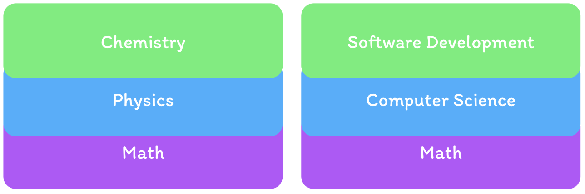

# 1.1. What is a Software Engineer?

A software engineer is someone who designs, develops, tests, and maintains software systems.

Some examples of software systems include web applications, mobile apps, desktop software, cloud services, embedded systems, operating systems, developer tools, and a lot more.

Software engineers use programming languages and tools to build software that meets user needs and solves real-world problems. They collaborate with other team members, such as designers, product managers, and more, to create high-quality software products.

## Computer Science vs Software Engineering

Due to computer science being a relatively new field, many people are still confused about what computer science and software engineering actually are, and how they relate to each other.

In my opinion, it's this gap in understanding that is one of **the root causes of why many students struggle to find jobs**.

Without this understanding, students lack the context and direction when presenting themselves through resumes, projects, and in interviews.

So let's break it down.

Software engineering is an applied discipline that is built on top of computer science, a theoretical discipline. **They are not one in the same**, but they are closely related.

Computer science focusses on the theory behind the principles of computation, algorithms, data structures, and the underlying mathematics of computing. It provides a foundation for understanding how computers work and how to solve problems using computational methods.

Software Engineers apply this knowledge to build software systems that solve real-world problems, while Computer Scientists study the theoretical aspects of computation and develop new techniques that can be applied in software engineering.

For example, a Computer Scientist might develop a new algorithm for sorting data more efficiently, while a Software Engineer would utilize that algorithm in a real-world application.

Here's a simple analogy to help clarify the difference:

Software Engineering is built off of Computer Science in the same way Physics is built off of Mathematics.

Knowing how to do complicated math proofs doesn't mean you know the physics to build a bridge, and knowing how to write a sorting algorithm doesn't mean you can build an app.

