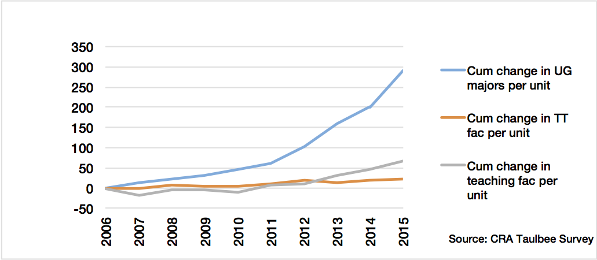

# 2.1. Graduates Are Becoming Less Capable

The rapid growth in enrollment in undergraduate computer science programs has outpaced available resources, resulting in overcrowded classrooms, limited faculty attention, and a decline in educational quality. The COVID-19 pandemic and the emergence of AI tools like ChatGPT have further complicated the academic landscape, making it more challenging for students to receive the education needed for success in the tech industry.

University programs now serve students with a wider range of prior programming experience. The increasing accessibility of technology has led to more students with limited technical backgrounds entering these programs, while financial incentives have attracted some students with less intrinsic motivation. This influx strains resources and can diminish the experience for highly motivated students.

It's these reasons that have led me to believe that graduates are becoming less capable.

## Too Many Students, Too Few Educators

According to the Computing Research Association, between 2005 and 2011, the average number of undergraduate CS majors at universities in the U.S. and Canada tripled [[0](https://cra.org/data/generation-cs/phenomenal-growth-cs-majors-since-2006/)], [while the tenure-track faculty in no way matched the same growth](https://cra.org/data/generation-cs/phenomenal-growth-cs-majors-since-2006/#:~:text=The%20increase%20in%20the%20number%20of%20tenure%2Dtrack%20faculty%20and%20teaching%20faculty%20in%20no%20way%20matches%20the%20growth%20in%20the%20number%20of%20undergraduate%20CS%20majors).

As a result, faculty are teaching larger classes and more classes are taught by visitors, adjuncts, postdocs, and graduate students.

Looking at the numbers you can derive online for enrollment between 2013 and 2023, you can tell that the number of students in computer science programs has only continued to skyrocket, easily doubling or tripling again in many cases at prominent universities.

| University             | 2013                                                                                                          | 2023                                                                                                             |
| ---------------------- | ------------------------------------------------------------------------------------------------------------- | ---------------------------------------------------------------------------------------------------------------- |
| UBC                    | 1,288 [[1](https://www.cs.ubc.ca/our-department/diversity/statistics)]                                        | 2,774 [[2](https://www.cs.ubc.ca/about/numbers)]                                                                 |
| University of Waterloo | 2,128 [[3](https://uwaterloo.ca/institutional-analysis-planning/section-common-university-data-ontario-2013)] | 4,000+ [[4](https://cs.uwaterloo.ca/about/quick-facts#:~:text=More%20than%204%2C000%20undergraduate%20students)] |
| Stanford University    | 452 [[5](https://irds.stanford.edu/data-findings/enrollment)]                                                 | 865 [[5](https://irds.stanford.edu/data-findings/enrollment)]                                                    |
| UC Berkeley            | 718 [[7](https://eecs.berkeley.edu/about/by-the-numbers/)]                                                    | 2,022 [[7](https://eecs.berkeley.edu/about/by-the-numbers/)]                                                     |

_**NOTE:** Please feel free to contribute additional enrollment numbers for other universities, as this list is not exhaustive._

It's worth noting that computing fields are grouped differently at different academic institutions, and that their boundaries will change over time, making it hard to compare numbers across universities. However, the trend is clear: enrollment in computer science programs has exploded over the past decade.

## Less Faculty, Less Student Support

[In the same CRA Enrollment Survey,](https://cra.org/data/generation-cs/units-response/) units were asked a wide range of questions about the impact of increased enrollment in undergraduate courses. They were asked to rate actions and management strategies explicitly taken or in process to manage the enrollment growth.

Actions like "significantly increase class sizes", "increase the number of course sections", and "reduce the number of low enrollment courses" were common responses.

It's widely accepted that the quality of education suffers when class sizes increase, and when faculty are stretched thin. The result is that students receive less individual attention, fewer opportunities for mentorship, and less feedback on their work.

Anecdotally, what I've seen is, huge class sizes lead to faculty needing to resort to methods that require less individual attention, such as using multiple-choice or "autogradeable" assignments that don't assess deeper understanding or simplifying assignments to make them easier to grade at scale.

The result is that the lack of depth and engagement in coursework leaves students unable to fully appreciate the value of higher education, diminishing their ability to make the most of their university years.

Without opportunities to explore and challenge ideas, students may leave university unprepared for the complexities of the real world, and most may graduate without ever having had an original idea about the field.

## Wide Spectrum of Entrance Experience

While technology is more present in everyday life than ever before, the actual technical experience of students entering computer science programs has become increasingly varied.

Some students arrive with years of programming experience, having built games, web apps, or completed online courses. Others have never written a single line of code and have little to no familiarity with basic computing concepts.

While this has always been the case to some extent, the gap has widened significantly in recent years thanks to the rise of simplified tech like iPads and Chromebooks, which have become common as early as elementary school. I regularly meet first-year students who have never used Windows, interacted with a file system, or installed software. These students are nowhere near the same level as those who have been programming for years.

The result is that incoming university students have vastly different levels of experience, and yet unless they go to one of the best schools on the continent, they are forced into a one-size-fits-all curriculum.

The reality is that it's near impossible to design a curriculum that effectively serves both students who have never coded before and those who have been programming for years.

It's like putting kindergarteners and high school students in the same classroom and expecting them to learn at the same pace. The disparity in prior knowledge leads to frustration for both groups, as neither feels adequately challenged or supported.

<!-- It's worth mentioning it's very hard to find statistics on the prior experience of students entering computer science programs, as most universities do not collect this data as there really isn't a standardized way to measure it. -->

### No Standardized Starting Line

Part of the issue stems from the fact that there is no universal or standardized high school curriculum for computer science.

Across North America, some high schools offer AP Computer Science or teach Python and Java as early as Grade 10, while others offer no programming instruction whatsoever.

Similarly, while programs like the International Baccalaureate (IB) or Advanced Placement (AP) exist, they are not universally recognized. Even students who complete these advanced high school courses often find that universities do not allow them to skip introductory material.

### Increased Lack of Tech Literacy

As a student mentor at Carleton University, I frequently meet first-year CS students who:

- Have never used Windows or interacted with a file system
- Don’t know how to install software or troubleshoot basic issues
- Grew up using only Chromebooks, iPads, or locked-down school laptops

Whereas I was introduced to concepts like files and executables in elementary school, the increase of simplified tech like iPads and Chromebooks has led to a generation of students who lack a good deal of foundational knowledge.

This lack of foundational literacy creates a cascading effect:

- Students struggle with basic tooling, slowing down their ability to pick up programming skills
- They avoid extracurriculars like coding competitions or clubs, seeing them as too advanced
- They lack the confidence or ability to build side projects—key experiences for internship applications

And while most computer science programs are designed with the assumption that students have no prior programming experience, they are rarely designed to handle students with no practical computing experience at all. Many courses continue to assume students understand basic ideas like files, directories, or how to use a terminal, when a growing portion of students do not.

### Experienced Students Are Systematically Held Back

Ironically, the opposite problem also exists. Technological accessibility has allowed many students to gain significant programming experience before entering university—having built games, web apps, or completed online courses at even earlier ages than ever before.

But because most university programs are built on the assumption of limited prior experience, all students—regardless of skill—are forced to start from the beginning.

This creates several problems:

- Advanced students sit through “kindergarten-level” courses that feel like a waste of time
- They become disengaged, skipping lectures or doing the bare minimum to pass
- They develop bad habits—overconfidence, laziness, ego, or resentment toward the program

The ability to skip early courses or take accelerated paths is often limited or non-existent.

### Lack of Acceleration in Canada

In Canada, only the University of British Columbia (UBC) offers a placement exam that allows students to test out of introductory courses. Most other universities, including Waterloo—which is widely considered the top CS school in the country—only “strongly encourage” experienced students to take advanced introductory courses (e.g. CS 145 instead of CS 135). However, CS 145 is not a true acceleration path, it advertises that it covers the same material with only a more theoretical framing.

Many of these students could be thriving if offered higher-level electives earlier or given opportunities to accelerate—but few programs offer formal pathways for this. As a result, high-potential students often go unchallenged and unsupported, drifting through their degree without any clear direction on how to continue growing.

### Acceleration in the United States

In the United States, there are slightly more options—but they vary dramatically from school to school.

Some top universities accept AP Computer Science as a way to skip introductory CS courses. Others offer their own internal placement tests during orientation or in the summer prior to enrollment.

For example:

- **MIT** allows students to bypass introductory CS courses through placement exams or by demonstrating competency via prior coursework or projects.
- **Stanford** provides placement diagnostics and gives credit for AP scores, though they often still recommend that students take their introductory series to align with the rest of the curriculum.
- **UC Berkeley** accepts AP credit but does not allow it to substitute core CS major requirements, encouraging students to retake the material in more depth.
- **Harvard** offers accelerated versions of intro courses (e.g. CS50x) but doesn't formally exempt students from prerequisites unless reviewed on a case-by-case basis.

However, outside of these top-tier schools, many universities still do not offer robust acceleration options. Students with significant prior experience often find themselves stuck in introductory courses that do not challenge them or help them grow.

### Students Who "Just Want a Job / Money"

There is also a sizeable portion of students who only entered computer science with the sole goal of getting a job or making money, rather than a genuine interest in the field.

This is not a new phenomenon, but it has become more pronounced in recent years as the tech industry has grown and the potential for high salaries has attracted more students.

While there is nothing inherently wrong with wanting a job or making money, this mindset can lead to a lack of intrinsic motivation and curiosity about the field.

I see these students struggle the most because they lack the drive to put in the work neccessary to develop the applied skills university often doesn't provide, let alone do well in their courses.

The reality is that software engineering is really a "craft" that requires practice, patience, and a genuine interest in building things. Students who do not have a genuine interest in the craft are unlikely to succeed in the long run, regardless of how much they want a job or money.

## AI’s Educational Shift

While the rise of large language models (LLMs) like ChatGPT offer new learning opportunities, it has also made _“cheating”_ more accessible and widespread than ever before.

Assignments that were already simplified to accommodate overcrowded classes and limited TA support like multiple choice assessments, fill-in-the-blanks, auto-graded code problems—are now trivial to solve using AI.

Students are increasingly relying on AI to do their assignments for them, often without any real understanding of the material. This is not just a problem of academic integrity; it’s a fundamental issue of learning and skill development.

Like it or not, tools like ChatGPT are here to stay. And just like calculators were eventually accepted in math education, universities must evolve rather than resist.

But the reality is that many universities are struggling to adapt.

## Damaged Student Community

COVID disrupted one of the most valuable parts of the university experience: the informal peer-to-peer advice networks that pass down career strategies, resume tips, and survival guides from upper years to first years.

Upper-year students often serve as:

- Mentors for internships and co-ops
- Guides on which professors to take or avoid
- Referrers to job opportunities and companies

These casual relationships have tangible effects. For example, I only landed my first paid tech job because upper-year students made it clear that it was _possible_, and helped me figure out how to get there. Before that, I thought I’d be lucky to get an unpaid volunteer role.

But students who started in Fall 2020 and 2021 missed this entirely. When they returned in-person in Fall 2022, the students who had those experiences were graduating or gone. This created a knowledge vacuum—one that hasn’t been fully refilled.

This has resulted in a generations of students who are less connected, less informed, and less prepared to navigate the complexities of univeristy and the job market.

## COVID Disrupted Growth

Having interacted with university students before and after the pandemic, it’s very clear that on average, students today are less capable than those who came before them — not because they lack talent or drive, but because they were denied the environment and opportunities that previous generations had.

It feels like everyone is essentially 1–2 years behind in their personal development. COVID disrupted the development of basic study skills, time management, and the ability to focus and work independently. These are core habits that students usually have some what figured out before university, however it’s much harder for these students to now catch up.

## Sources:

- [0] https://cra.org/data/generation-cs/phenomenal-growth-cs-majors-since-2006/
- [1] https://www.cs.ubc.ca/our-department/diversity/statistics
- [2] https://www.cs.ubc.ca/about/numbers
- [3] https://uwaterloo.ca/institutional-analysis-planning/section-common-university-data-ontario-2013
- [4] https://cs.uwaterloo.ca/about/quick-facts#:~:text=More%20than%204%2C000%20undergraduate%20students
- [5] https://irds.stanford.edu/data-findings/enrollment
- [6] https://www.cs.ucla.edu/wp-content/uploads/cs/Annual2013.pdf
- [7] https://eecs.berkeley.edu/about/by-the-numbers/
- [8] https://cra.org/data/generation-cs/phenomenal-growth-cs-majors-since-2006/#:~:text=The%20increase%20in%20the%20number%20of%20tenure%2Dtrack%20faculty%20and%20teaching%20faculty%20in%20no%20way%20matches%20the%20growth%20in%20the%20number%20of%20undergraduate%20CS%20majors
