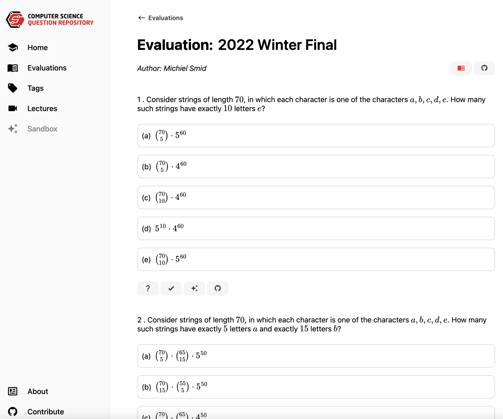
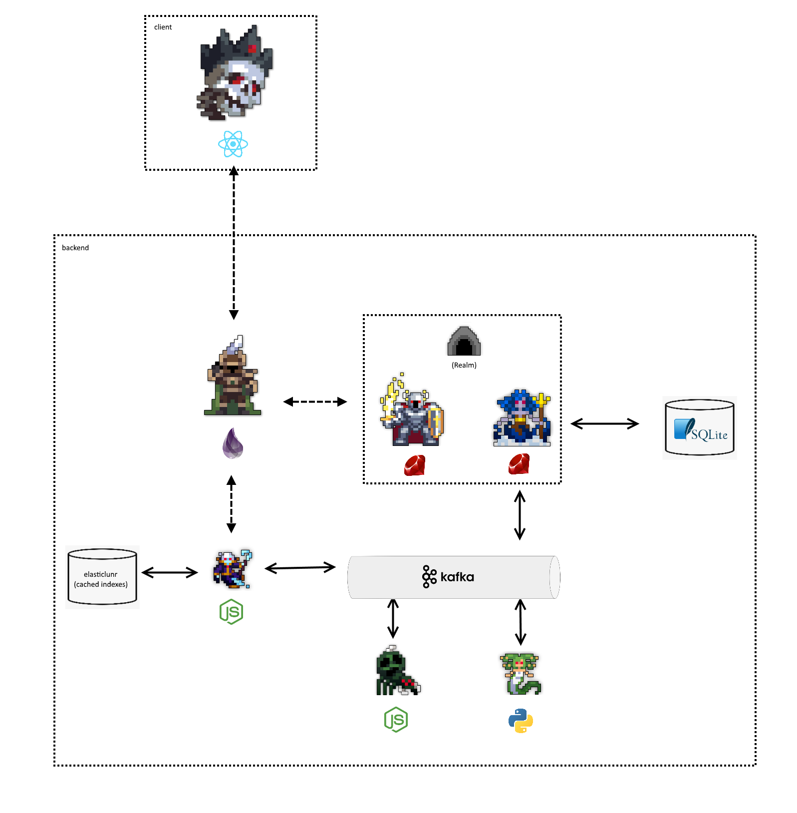

# 3.3. Build Your Portfolio

You're going to build some projects during university and (especially during your upper year electives) your going to often have the ability to choose what you want to build.

You should take these opportunities to not just fulfill the course requirements, but also build your portfolio.

When you get an opportunity to build something, ask yourself:

- Can I use this to learn a new skill or technology?
- Can I use this to build something that I can show off to employers?
- Can make something that won't just get thrown away after the course is over?

Students often say they don't have time to build projects outside of their coursework, and while coursework does take time, if you find it hard to find time to build projects, it's actually a time safer if you knock out two birds with one stone.

We will be doing a deep dive into building good projects in chapter 6.1np.

## Personal Examples

Here are some personal examples of mine that I built during my time at Carleton University.

### Bookstore Application

During my 2nd year at Carleton University, I took a databases course where our final project was to make a simple "Bookstore" application.

To pass, all you had to do was make a simple CLI application that could add, remove, and search for books in a database.

However, I decided to take this opportunity to build a full-stack web application using Golang (which I had never used before), React, and PostgreSQL.

I also decided to play with Docker and Kubernetes for the first time to deploy it to a cloud provider.

You can still find the code for this project on my GitHub: [MathyouMB/Bookstore](https://github.com/MathyouMB/bookstore). It's not good code by any means, but it was a great learning experience.

### Discrete Math Practice App

In my 2nd year, I took a discrete math course that had multiple choice midterms and finals.

The professor provided a set of practice questions, but I found it tedious to go back and forth between the questions pdf and the answers pdf.

So I decided to build a simple web application that would allow me to practice the questions in a more interactive way.

The website has gone through 3 different iterations, over the past 7 years, but it still is online to this day and has been used by **thousands of students** studying this course at Carleton University.

Here is the link to the latest version: [CarletonComputerScienceSociety/questions](https://github.com/CarletonComputerScienceSociety/questions).

### Microservice Search Engine

During my 4th year, I took a course with a project that involved building a search engine.

The course only required a single express.js webserver that searched pre indexed data, but I decided to take it a step further and build a microservice architecture with services in Elixir, Python, Javascript, Ruby, and a Kafka message broker.

Did this take more time than just building a single webserver? Yes, but I got way more out of this than just some grade. I might have even gotten a worst grade than I would have if I just built the single webserver, but I learned so much more.

You can find the code for this project on my GitHub: [MathyouMB/comp4601-a1](https://github.com/MathyouMB/comp4601-a1).

