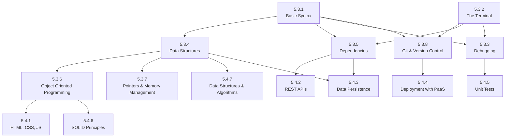

# 5.2. L2: Simple Web Applications

Level 1 is about writing code that runs. Level 2 is about writing code that people can actually use—over the web, with a real interface, data that persists, and maybe even some users.

At this level, your goal is to build and ship a basic full-stack application—nothing fancy, just something that ties together a frontend, backend, and database. You’ll make design choices, deal with bugs, wrestle with deployment, and start to understand how all the moving pieces of modern software fit together.

Most of the skills in this chapter do not depend on each other, but do depend on the skills you learned in Level 1. You can learn them in any order, but they all contribute to your ability to build a complete application.

## Why Web Applications?

Web applications are a popular development choice because anyone with a browser can use them. In contrast, native applications require users to install software and are often tied to a specific device or operating system.

Instead of having to build a separate app for each platform (iOS, Android, Windows, etc.), you can build a single web application that runs on any device with a web browser. This makes web applications more accessible and easier to maintain.

## Do I Need To Know Frontend and Backend?

As you'll recall from chapter 4, the answer is no. You don't need to specialize in both to get hired.

But the reality is that with the difficulty of finding a job, having the skills needed to do both frontend and backend development will make you a more attractive candidate.
