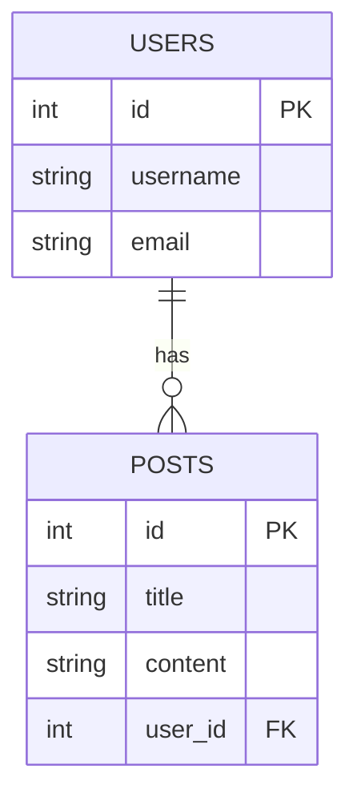

# 5.3.4. Relational Database Design

At some point, your programs will need to store data—user profiles, messages, products, posts, whatever. When that time comes, you’ll need a database.

**Relational databases** are the most widely used type of database in software development. They’re fast, reliable, and designed to handle structured data with complex relationships.

If you’ve used apps like Instagram or Spotify, you’ve interacted with a relational database—behind the scenes, every user, playlist, or comment is a row in a table.

## What Is a Relational Database?

A **relational database** stores data in **tables**, where each table represents a type of entity (e.g., users, posts, orders). Each **row** in a table is a record, and each **column** represents a field.

It’s called “relational” because these tables can be connected—or _related_—to each other through **keys**.

For example:

- A `users` table stores all users.
- A `posts` table stores all posts.
- Each post has a `user_id` column that links it to the user who created it.

This relationship between `users.id` and `posts.user_id` is the backbone of relational design.

## Keys and Relationships

Here are some important terms you need to know:

- **Primary Key**: A unique identifier for each row in a table (usually called `id`).
- **Foreign Key**: A reference to a primary key in another table.
- **One-to-Many**: One user can have many posts.
- **Many-to-Many**: One student can enroll in many courses, and each course can have many students (requires a join table like `enrollments`).

Good relational design is about **breaking your data into logical pieces**, then **connecting them with keys** so that you can efficiently query across them.

## Normalization

**Normalization** is the process of organizing your database to reduce duplication and improve integrity.

For example, instead of storing a user’s name next to every post they write, you store the name in the `users` table and link each post to the user via `user_id`.

This way:

- You save space
- You avoid inconsistency
- You only need to update the name in one place

The rule of thumb: **store data once, reference it everywhere else.**

## Querying with SQL

Most relational databases (like PostgreSQL, MySQL, and SQLite) use **SQL** (Structured Query Language) to read and write data.

Example: Getting all posts written by a specific user.

```sql
SELECT * FROM posts
WHERE user_id = 42;
```

SQL lets you filter, sort, group, join, and update data—it's one of the most useful tools you can learn as a developer.

## Visualizing Relationships: ERD Diagrams

When designing a database, it helps to sketch out your tables and how they relate to each other. That’s where an **Entity-Relationship Diagram (ERD)** comes in.

An **ERD** is a visual representation of your database schema. It shows:

- **Entities** (usually tables, like `users` or `posts`)
- **Attributes** (the columns in each table, like `id`, `name`, or `email`)
- **Relationships** between entities (e.g., a user "has many" posts)

Here’s a simplified example:



This tells us:

- Each post belongs to one user
- Each user can have many posts
- `user_id` in the `Posts` table links to `id` in the `Users` table
