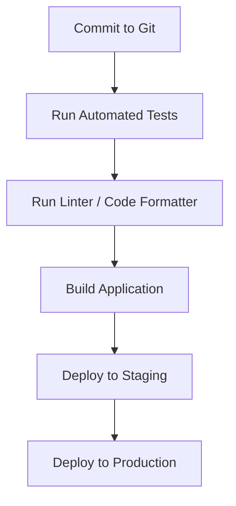

# 5.3.9. Continuous Integration & Deployment

Once your project starts growing, testing and shipping changes manually becomes slow, error-prone, and stressful. That’s where **Continuous Integration** (CI) and **Continuous Deployment** (CD) come in.

Together, CI/CD automates your workflow so that new code is tested, reviewed, and deployed quickly and safely. These practices are considered standard in modern software development—and being familiar with them is expected for almost any internship or job.

## What Is Continuous Integration (CI)?

**Continuous Integration** means that every time you push code to your repository, a series of automated checks are run:

- Tests are executed
- Your code is built (if needed)
- Linting or formatting rules are enforced
- Problems are caught early

This makes it easier to catch bugs **before** they reach production and ensures everyone on the team is working with reliable, tested code.

### Example CI workflow:

1. You push a new commit to GitHub.
2. GitHub Actions or another CI tool runs your test suite.
3. If any tests fail, your pull request is blocked until they pass.

## What Is Continuous Deployment (CD)?

**Continuous Deployment** takes it a step further: once your changes pass all the automated tests, they are **automatically deployed** to production (or staging).

If your team isn’t comfortable with full automation, you might use **Continuous Delivery** instead—where the code is automatically prepared for deployment but released manually with one click.

### Benefits of CD:

- Less time spent deploying by hand
- Fewer mistakes during releases
- Faster feedback from real users

## Common CI/CD Tools

These tools connect to your Git repository and run your pipeline automatically:

- **GitHub Actions** – Great for open-source and student projects
- **GitLab CI** – Built into GitLab
- **CircleCI** – Fast and free for small projects
- **Jenkins** – Highly customizable, used in larger organizations
- **Vercel / Netlify** – Automatically deploy front-end apps from Git

## Typical CI/CD Pipeline

You can customize the pipeline to include things like:

- Security scans
- Code coverage reports
- Notifications to Slack or Discord

## How to Get Started

1. Set up a GitHub repo for your project
2. Add a `.github/workflows/ci.yml` file to run your tests automatically

## Knowledge Checklist

- [ ] I understand the difference between Continuous Integration and Continuous Deployment
- [ ] I can explain the benefits of having automated tests and builds
- [ ] I have used a CI tool like GitHub Actions or GitLab CI
- [ ] I can write a simple CI workflow to run tests on every push
- [ ] I’ve tried deploying a project automatically after a successful commit
