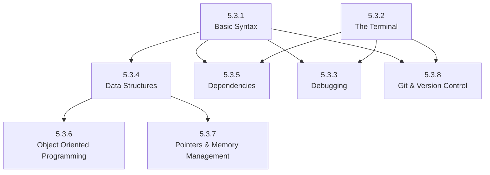

# 5.3. L1: Programming Fundamentals

Before you can build real-world software, you need to develop a solid foundation in programming. This chapter introduces the essential skills and mental models every developer must learn at the beginning of their journey.

These aren’t just theoretical topics — they’re the core tools you’ll use every day, from solving simple problems to building full-scale applications. Understanding these concepts will also give you the confidence to tackle more advanced topics later in your learning journey.

This chapter is structured as a **roadmap**: each section builds on the previous ones, and many topics reinforce one another. For example, you can’t write meaningful code without learning syntax, but you won’t get very far unless you also understand how to debug it, organize it, and collaborate with others using version control.

Here’s how the major topics in this chapter are connected:

