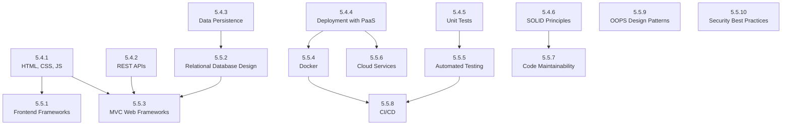

# 5.5. L3: Production-Ready Applications

```mermaid
graph TD
    %% --- 4.x Essential Application Development ---
    I[5.4.1<br>HTML, CSS, JS]
    J[5.4.2<br>REST APIs]
    K[5.4.3<br>Data Persistence]
    L[5.4.4<br>Deployment with PaaS]
    M[5.4.5<br>Unit Tests]
    N[5.4.6<br>SOLID Principles]

    %% --- 5.5 Production-Ready Applications ---
    P[5.5.1<br>Frontend Frameworks]
    R[5.5.2<br>Relational Database Design]
    Q[5.5.3<br>MVC Web Frameworks]
    S[5.5.4<br>Docker]
    T[5.5.5<br>Automated Testing]
    U[5.5.6<br>Cloud Services]
    V[5.5.7<br>Code Maintainability]
    W[5.5.8<br>CI/CD]
    X[5.5.9<br>OOPS Design Patterns]
    Y[5.5.10<br>Security Best Practices]

    %% --- Edges: Prod-Ready ---
    I --> P
    I --> Q
    J --> Q
    K --> R
    L --> S
    M --> T
    L --> U
    N --> V
    S --> W
    R --> Q
    T --> W

    click I "/docs/essential-application-development/html-css-js"
    click J "/docs/essential-application-development/rest-apis"
    click K "/docs/essential-application-development/data-persistence"
    click L "/docs/essential-application-development/deployment-with-paas"
    click M "/docs/essential-application-development/unit-tests"
    click N "/docs/essential-application-development/solid-principals"
    click O "/docs/essential-application-development/data-structures-and-algorithms"

    click P "/docs/production-ready-applications/frontend-frameworks"
    click Q "/docs/production-ready-applications/mvc-web-frameworks"
    click R "/docs/production-ready-applications/relational-database-design"
    click S "/docs/production-ready-applications/docker"
    click T "/docs/production-ready-applications/automated-testing"
    click U "/docs/production-ready-applications/cloud-services"
    click V "/docs/production-ready-applications/code-maintainability"
    click W "/docs/production-ready-applications/ci-cd"
```
