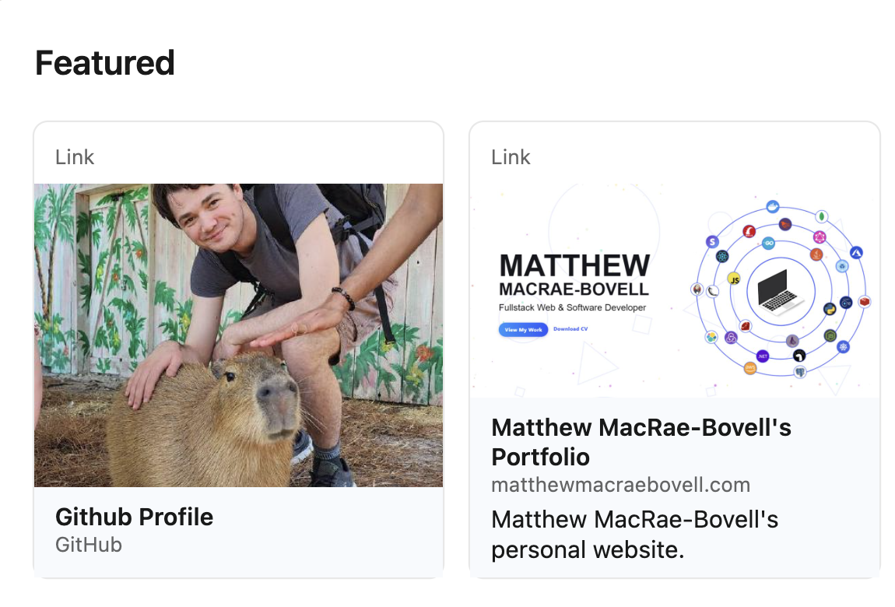
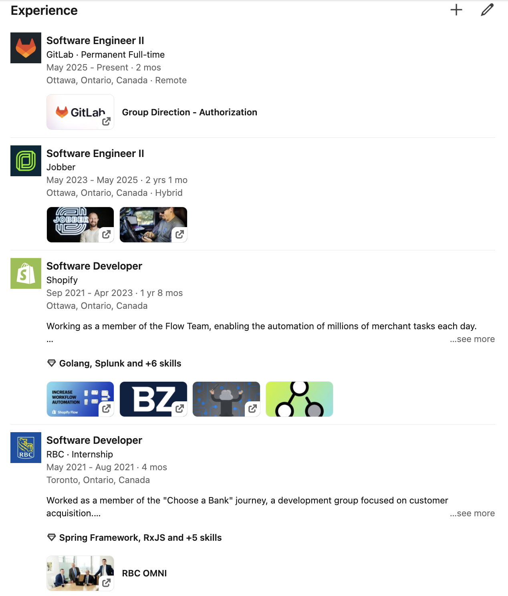

# 7.4. LinkedIn

Connecting with recruiters on LinkedIn is the modern equivalent of dropping off your resume in person.

## How To Reach Out To Recruiters

With companies you want to work for, search their employees for **recruiters** or **early-talent specialists**. These are the people who are responsible for finding and hiring interns and entry-level candidates.

When you find a recruiter who works at a company you're interested in, send them a connection request with a personalized message.

Here's some examples I've used in the past:

- Hello! I'm (name) a student with a background in (x,y,z). I just saw your post about (company) attending the (university) career fair, and was wondering if (company) was planning to come to (university) and when (company) normally starts hiring students for the summer.

- Hi (name)! I just saw (company)'s new Software Engineer Co-op job posting and was wondering if I could ask a of couple questions. I'm a computer science student with experience with (skill), (skill), and (skill) and I'd love to learn more about the position!

- Hi (name)! I just applied to the (title) position you included in your post! With my previous experience working on (team name) teams at companies like (company), (company), and (company). I think I could be a strong applicant for the role.

This is the modern equivalent of dropping off your resume in person. It's also way shorter than a cover letter, so it’s less intimidating for both you and the recruiter.

## Your Profile

Your LinkedIn profile should be more than a copy paste of your resume.

It should give the recruiter more context about who you are, what you’re interested in, and what you can bring to the table.

I would recommend making your profile feel full. A full profile gives off the impression that you care and could be a top candidate.

Some ways you can fill out your profile:

### Add Featured Links

Include links to your portfolio, GitHub, or any other relevant projects. This gives recruiters a chance to see your work in action.

Here is an example from my profile:

### Add Skills and Links To Experiences

Adding skills will help recruiters find you when they search for candidates with specific skills.

Adding links to your experiences will help recruiters see the work you’ve done and the impact you’ve made.

It helps make your profile look more complete and gives recruiters a better understanding of your background.

Here are some examples from my profile (ignore the fact I haven't added bullets for my latest two roles):

## How Activity Affects Your Profile

LinkedIn favors active users. A few things that can help you show up more in searches:

- React to posts from people at companies you want to work for
- Share cool projects you’re working on
- Follow companies you're interested in

This doesn’t mean you need to become a LinkedIn influencer. Just being semi-active signals to the algorithm (and recruiters) that you're engaged and open to opportunities.

## How Recruiters Use LinkedIn

Recruiters have access to a special version of LinkedIn that allows them to search for candidates based on specific criteria.

When they search for candidates, they often look for:

- Specific technical skills (e.g., programming languages, frameworks)
- Relevant work experience (e.g., internships, projects)
- Keywords from the job description

This is why it's important to optimize your LinkedIn profile with the right keywords and to showcase your skills and experiences effectively.

As a student, this may not be as important, but as you gain more experience, it becomes crucial to keep your profile up-to-date and aligned with the roles you're targeting.
